## 🎓 Real-Time data pipelines with Apache Pulsar™ and Apache Cassandra™


[](https://gitpod.io/#https://github.com/datastaxdevs/workshop-realtime-data-pipelines)
[](http://www.apache.org/licenses/LICENSE-2.0)
[](https://discord.com/widget?id=685554030159593522&theme=dark)

Welcome to the *RealTime data pipeline with Apache Pulsar and Apache Cassandra** workshop! In this two-hour workshop, we will show you a sample architecture making use of Apache Pulsar™ and Pulsar Functions for real-time, event-streaming-based data ingestion, cleaning and processing.

⏲️ **Duration :** 2 hours

🎓 **Level** Beginner to Intermediate


> [🔖 Accessing HANDS-ON](#-start-hands-on)

## 📋 Table of contents

- **HouseKeeping**
  - [Objectives](#objectives)
  - [Frequently asked questions](#frequently-asked-questions)
  - [Materials for the Session](#materials-for-the-session)
- **Architecture Design**
  - [Architecture overview](#architecture-overview)
  - [Injector Component](#injector-component)
  - [Analyzer Component](#analyzer-component)
- [Setup - Initialize your environment](#setup---initialize-your-environment)
- [LAB1 - Producer and Consumer](#lab1---producer-and-consumer)
- [LAB2 - Pulsar functions](#lab2---pulsar-functions)
- [LAB3 - Working with Database](#lab3---working-with-databases)
- [LAB4 - Pulsar I/O](#lab4---pulsar-io)
- [Homework](#Homework)
<p>

## Objectives

- 🎯 Give you an understanding and how and where to position Apache Pulsar

- 🎯 Give an overview of  streaming and datascience ecosystem**

- 🎯 Give you an understanding of Apache Cassandra NoSQL Database

- 🎯 Create your first pipeline with streaming and database.

- 🚀 Have fun with an interactive session

## Frequently asked questions

<p/>
<details>
<summary><b> 1️⃣ Can I run this workshop on my computer?</b></summary>
<hr>
<p>There is nothing preventing you from running the workshop on your own machine. If you do so, you will need the following:
<ol>
<li><b>git</b>
<li><b>Python 3.6+</b>
<li><b>Astra Cli</b>
<li><b>Pulsar Shell or Pulsar-Client</b>
</ol>
</p>
In this readme, we try to provide instructions for local development as well - but keep in mind that the main focus is development on Gitpod, hence <strong>we can't guarantee live support</strong> about local development in order to keep on track with the schedule. However, we will do our best to give you the info you need to succeed.
</details>
<p/>
<details>
<summary><b> 2️⃣ What other prerequisites are required?</b></summary>
<hr>
<ul>
<li>You will need enough *real estate* on screen, we will ask you to open a few windows and it would not fit on mobiles (tablets should be OK)
<li>You will need an Astra account: don't worry, we'll work through that in the following
<li>As "Intermediate level" we expect you to know what java and Spring are. 
</ul>
</p>
</details>
<p/>
<details>
<summary><b> 3️⃣ Do I need to pay for anything for this workshop?</b></summary>
<hr>
<b>No.</b> All tools and services we provide here are FREE. FREE not only during the session but also after.
</details>
<p/>
<details>
<summary><b> 4️⃣ Will I get a certificate if I attend this workshop?</b></summary>
<hr>
Attending the session is not enough. You need to complete the homework detailed below and you will get a nice badge that you can share on linkedin or anywhere else *(open badge specification)*
</details>
<p/>

## Materials for the session

It doesn't matter if you join our workshop live or you prefer to work at your own pace,
we have you covered. In this repository, you'll find everything you need for this workshop:

- [Slide deck](/slides/slides.pdf)
- [Discord chat](https://dtsx.io/discord)
- [Questions and Answers](https://community.datastax.com/)
- [Twitch backup](https://www.twitch.tv/datastaxdevs)

## Architecture Design

_Reviews of various venues (hotels/restaurants), written by various users, keep pouring in. We need a way to clean, normalize and filter them, removing trolls and flagging blatant outlier reviews, and make the running results available to the end user._

#### Architecture overview

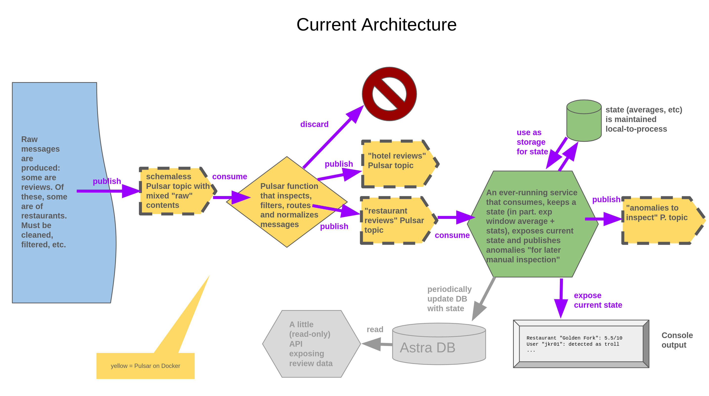

<details>
<summary><b> Show Detailed explanations</b></summary>

<ul>
<li>A stream of "events" (messages), some of which are reviews, is poured into a Pulsar topic for "raw reviews".
<li>A Pulsar function filters out malformed items and those that do not specify their target type (restaurant/hotel). This function takes care of normalizing the incoming reviews, since - as is often the case in real life - certain field names in the incoming reviews can have multiple forms. All reviews are encoded as JSON strings. The Pulsar function singles out hotel and restaurant reviews and routes them, after normalizing their structure, to two specific topics. 
<li>We happen to be interested in restaurants, so we have a long-running process ("analyzer") performing the actual analysis on these. Heavy artillery, such as AI/ML-based classifiers, code with fat dependencies and the like, would be placed here (i.e outside Pulsar).

<li>The analyzer keeps listening to the restaurant topic and ingests all incoming reviews: it keeps and update a state with key information, such as a rolling average score per each restaurant.

<li>As new items arrive, they are checked if they are "troll reviews" (review text in heavy disagreement with the numeric score) and, if so, discarded. Otherwise they enter the rolling average for the target restaurant.

<li>The analyzer periodically publishes an assessment for users and restaurants to a database, ready to be queried by any service that may need this data. (The output can also go to console if so desired). The destination DB also offers a ready-to-use REST API that allows to retrieve its data with simple HTTP requests, making it easy to build panels and UIs on top of this pipeline. The analyzer also reroutes "outlier reviews" (scores much different than the current rolling average) to another Pulsar topic, for a hypothetical manual inspection of such outliers.
</ul>
</p>
</details>

#### Injector Component

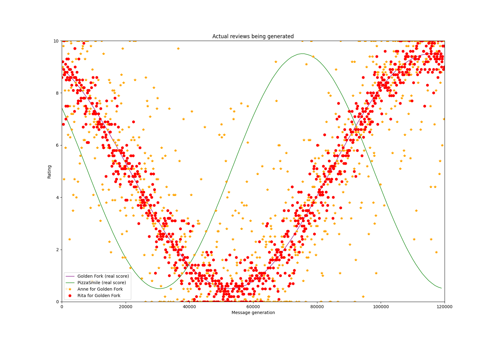

<details>
<summary><b> Show Details</b></summary>
<p>
There is a pseudorandom procedure to generate reviews with features that fluctuate in a predictable
way: it is all in the <b>revGenerator</b> directory.

There is no "time" in the generation: to keep things simple, we use a "sequence index" in place of
time. Also, some of the "reviews" are not even valid JSON strings but contain gibberish instead,
as is often the case in real-life data ingestion pipelines!

Each time a review is created, a venue (target) and a user (reviewer) are chosen at random: then,
score and text are also created according to the following rules:

Each venue has a "true" quality that is slowly oscillating in time, see for example these two restaurants:

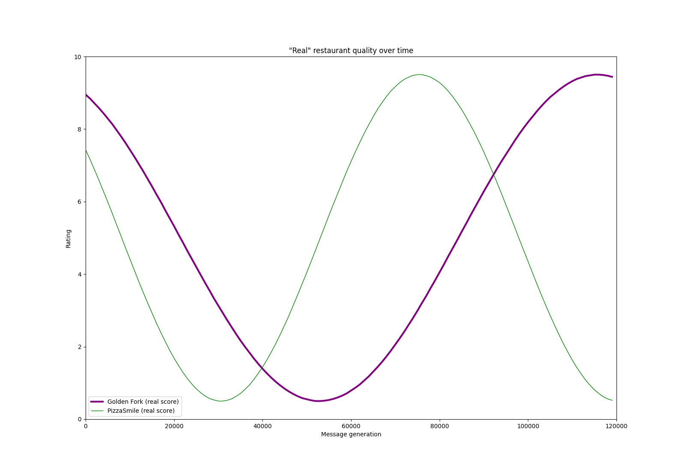

Each reviewer has an associate amplitude that dictates how widely the scores they produce
may fluctuate away from the "true" value for that venue at that "time": in this example, the individual
scores emitted by two different reviewers, having a large and small associated amplitude, are plotted:


While reviews by Rita will presumably all fall in the "expected" region around the current average,
a large fraction of the reviews by Anne will be too far away from
it and thus be flagged as "outlier reviews".

Each review comes with an associated text, which in this toy
example is simply a bunch of words strung together, some positive ("delicious") and some negative ("disgusting").
Each reviewer, however, has a Boolean "trolliness" flag: if true, then this text is built in strong
disagreement with the numeric score in the review.
</p>
</details>

#### Analyzer Component

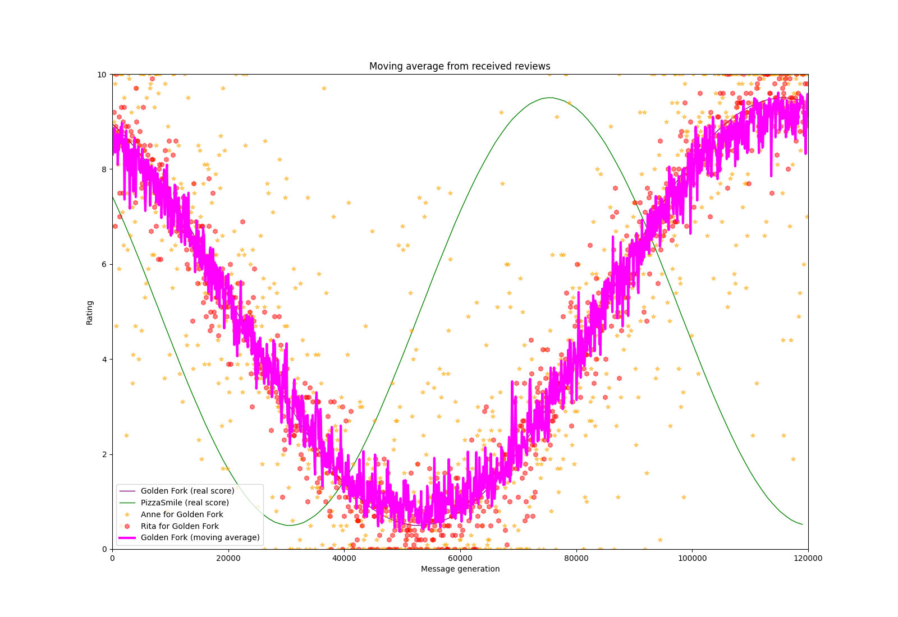

<details>
<summary><b> Show Details</b></summary>
<p>
On the <b>analyzer side</b>, the reconstructed rolling average roughly follows the "true" quality for
a venue, and is used to detect "outliers": each review that differs too much from the current rolling
average is deemed an outlier. Here the rolling average corresponding to the above restaurant is plotted:


The analyzer also discards troll reviews and keeps a running 
counter of them, both per-user and per-restaurant, ready to be exposed with the other data. To do so, a toy version of a sentiment analysis is implemented (simply based on some words with positive
and negative connotation) and used to compare with the numeric
score given in the review.

</p>
</details>

--- 

# 🏁 Start Hands-on

## Setup - Initialize your environment

#### `✅.setup-01`- Open Gitpod

Gitpod is an IDE based on VSCode deployed in the cloud.


> ↗️ _Right Click and select open as a new Tab..._

<a href="https://gitpod.io/#https://github.com/datastaxdevs/workshop-realtime-data-pipelines"></a>

#### `✅.setup-02`- Create your Astra Account: Following web page opened by gitpod or follow this link

_**`ASTRA`** is the simplest way to run both Cassandra and Pulsar with zero operations at all - just push the button and get your clusters. No credit card required_

Leveraging [Database creation guide](https://awesome-astra.github.io/docs/pages/astra/create-instance/#c-procedure) create a database. *Right-Click the button* with *Open in a new TAB.*

The Astra registration page should have opened with Gitpod, if not use [this link](https://astra.dev/yt-9-14).

#### `✅.setup-03`- Create Astra Credentials (token): Create an application token by following <a href="https://awesome-astra.github.io/docs/pages/astra/create-token/" target="_blank">these instructions</a>. 

Skip this step is you already have a token. You can reuse the same token in our other workshops, too.

> Your token should look like: `AstraCS:....`

> **⚠️ Important**
> ```
> The instructor will show you on screen how to create a token 
> but will have to destroy to token immediately for security reasons.
> ```

#### `✅.setup-04`- Setup Astra CLI

Go back to your gitpod terminal waiting for your token. Make sure you select the `1_producer` shell in the bottom-right panel and provide the value where it is asked.

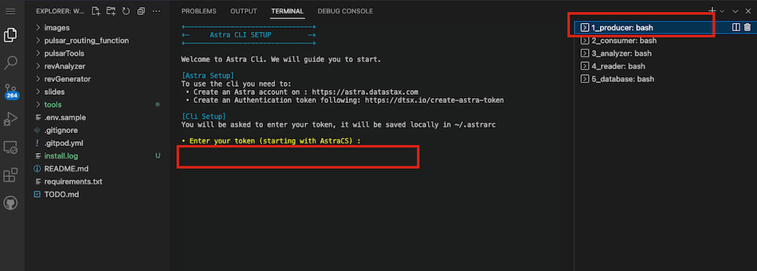

> 🖥️ `setup-04 output`
>
> ```
> [cedrick.lunven@gmail.com]
> ASTRA_DB_APPLICATION_TOKEN=AstraCS:AAAAAAAA
> 
> [What's NEXT ?]
> You are all set.(configuration is stored in ~/.astrarc) You can now:
>    • Use any command, 'astra help' will get you the list
>    • Try with 'astra db list'
>    • Enter interactive mode using 'astra'
> 
> Happy Coding !
> ```

#### `✅.setup-05`- List your existing Users.

```bash
astra user list
```

> 🖥️ `setup-05 output`
>
> ```
> +--------------------------------------+-----------------------------+---------------------+
> | User Id                              | User Email                  | Status              |
> +--------------------------------------+-----------------------------+---------------------+
> | b665658a-ae6a-4f30-a740-2342a7fb469c | cedrick.lunven@datastax.com | active              |
> +--------------------------------------+-----------------------------+---------------------+
> ```

#### `✅.setup-06`- Create database `workshops` and keyspace `trollsquad` if they do not exist:

```bash
astra db create workshops -k trollsquad --if-not-exist --wait
```

Let's analyze the command:
| Chunk         | Description     |
|--------------|-----------|
| `db create` | Operation executed `create` in group `db`  |
| `workshops` | Name of the database, our argument |
|`-k trollsquad` | Name of the keyspace, a db can contains multiple keyspaces |
| `--if-not-exist` | Flag for itempotency creating only what if needed |
| `--wait` | Make the command blocking until all expected operations are executed (timeout is 180s) |

> **Note**: If the database already exist but has not been used for while the status will be `HIBERNATED`. The previous command will resume the db an create the new keyspace but it can take about a minute to execute.

> 🖥️ `setup-06 output`
>
> ```
> [ INFO ] - Database 'workshops' already exist. Connecting to database.
> [ INFO ] - Database 'workshops' has status 'MAINTENANCE' waiting to be 'ACTIVE' ...
>[ INFO ] - Database 'workshops' has status 'ACTIVE' (took 7983 millis)
> ```

#### `✅.setup-07`- Check the status of database `workshops`

```bash
astra db status workshops
```

> 🖥️ `setup-07 output`
>
> ```
> [ INFO ] - Database 'workshops' has status 'ACTIVE'
> ```

#### `✅.setup-08`- Get the informations for your database including the keyspace list

```bash
astra db get workshops
```

> 🖥️ `setup-08 output`
>
> ```
> +------------------------+-----------------------------------------+
> | Attribute              | Value                                   |
> +------------------------+-----------------------------------------+
> | Name                   | workshops                               |
> | id                     | bb61cfd6-2702-4b19-97b6-3b89a04c9be7    |
> | Status                 | ACTIVE                                  |
> | Default Cloud Provider | AWS                                     |
> | Default Region         | us-east-1                               |
> | Default Keyspace       | trollsquad                              |
> | Creation Time          | 2022-08-29T06:13:06Z                    |
> |                        |                                         |
> | Keyspaces              | [0] trollsquad                          |
> |                        |                                         |
> |                        |                                         |
> | Regions                | [0] us-east-1                           |
> |                        |                                         |
> +------------------------+-----------------------------------------+
> ```

*Congratulations your environment is all set, let's start the labs !*

## LAB1 - Producer and Consumer


#### `✅.lab1-01`- Generate an unique tenant name

> **Note**: Your tenant name must start with a lowercase alphabetic character. It can only contain lowercase alphanumeric characters, and hyphens (kebab-case), and the maximum length is 25.

A tenant name should BE UNIQUE IN ALL CLUSTER. So to get a unique name let's generate one randomly.

```bash
export TENANT="trollsquad-$(tr -dc a-z0-9 </dev/urandom | head -c 9 ; echo '')"
echo $TENANT
```

> 🖥️ `lab1-01 output`
>
> ```
> trollsquad-abcdefghi
>```

#### `✅.lab1-02`- Create the tenant using the generated name

You can create a tenant from the user interface using [this tutorial](https://docs.datastax.com/en/astra-streaming/docs/astream-quick-start.html#create-a-tenant) but we will not use this today.

We will use the CLI for everyone to share the same values for regions and cloud provider. We will default all values for simplicity and because they are harcoded in the configuration file.

```bash
astra streaming create ${TENANT}
```

> 🖥️ `lab1-02 output`
>
> ```
> [ INFO ] - Tenant 'trollsquad-abcdefghi' has being created.
>```


#### `✅.lab1-03`- List your tenants

```bash
astra streaming list
```

> 🖥️ `lab1-03 output`
>
>```
> +---------------------+-----------+----------------+----------------+
> | name                | cloud     | region         | Status         |
> +---------------------+-----------+----------------+----------------+
> | trollsquad-abcdefghi| aws       | useast2        | active         |
> +---------------------+-----------+----------------+----------------+


#### `✅.lab1-04`- Start `Pulsar-shell`

> **Note** Pulsar shell is a fast and flexible shell for Pulsar cluster management, messaging, and more. It's great for quickly switching between different clusters, and can modify cluster or tenant configurations in an instant.

Astra CLI will download and install the software if needed. Then it will generate a `client.conf` based on the tenant name you provide.

```bash
astra streaming pulsar-shell ${TENANT}
```

> 🖥️ `lab1-04 output`
> ```
> [ INFO ] - pulsar-shell first launch, downloading (~ 60MB), please wait...
> [ INFO ] - pulsar-shell has been installed
> /home/gitpod/.astra/lunastreaming-shell-2.10.1.1/conf/client-aws-useast2-trollsquad-pk6oztya8.conf
> Pulsar-shell is starting please wait for connection establishment...
> Using directory: /home/gitpod/.pulsar-shell
> Welcome to Pulsar shell!
>   Service URL: pulsar+ssl://pulsar-aws-useast2.streaming.datastax.com:6651
>   Admin URL: https://pulsar-aws-useast2.api.streaming.datastax.com
> 
> Type help to get started or try the autocompletion (TAB button).
> Type exit or quit to end the shell session.
> 
> default(pulsar-aws-useast2.streaming.datastax.com)> 
> ```

#### `✅.lab1-05`- Show namespaces in `pulsar-shell`

```bash
admin namespaces list ${TENANT}
```

> 🖥️ `lab1-05 output`
>
> ```
> trollsquad-abcdefghi/default
>```

#### `✅.lab1-06`- Show topics in `pulsar-shell` (empty)

```bash
admin topics list ${TENANT}/default
```

> 🖥️ `lab1-06 output`
>
> ```
> <empty>
>```

#### `✅.lab1-07`- Create our 4 working topics, one command after the other.

- `rr-raw-in`

```bash
admin topics create persistent://${TENANT}/default/rr-raw-in
```

- `rr-hotel-reviews`

```
admin topics create persistent://${TENANT}/default/rr-hotel-reviews
```

- `rr-restaurant-reviews`

```
admin topics create persistent://${TENANT}/default/rr-restaurant-reviews
```

- `rr-restaurant-anomalies`

```
admin topics create persistent://${TENANT}/default/rr-restaurant-anomalies
```

- List the topics

```
admin topics list ${TENANT}/default
```

> 🖥️ `lab1-07 output`
> ```
> persistent://trollsquad-abcdefghi/default/rr-raw-in
> persistent://trollsquad-abcdefghi/default/rr-restaurant-anomalies
> persistent://trollsquad-abcdefghi/default/rr-hotel-reviews
> persistent://trollsquad-abcdefghi/default/rr-restaurant-reviews
> ```

Let's dig into what those topics are used for. The will be populated one after this other moving across the labs.

| Title | description |
|----|-----|
| `rr-raw-in`| Will get inputs from injector|
| `rr-hotel-reviews`| Pulsar function router will put hotels reviews there|
| `rr-restaurant-reviews`| Pulsar function router will put restaurants reviews there|
| `rr-restaurant-anomalies`| The analyzer will reject reviews there|


#### `✅.lab1-08` -  Exit `pulsar-shell`

```bash
exit
```

#### `✅.lab1-09`- Create `.env` as configuration file

```
cp .env.sample .env
ASTRA_DB_ID=`astra db get workshops --key id`
echo "ASTRA_DB_ID=\"${ASTRA_DB_ID}\"" >> .env
ASTRA_DB_APP_TOKEN=`astra config get default --key ASTRA_DB_APPLICATION_TOKEN`
echo "ASTRA_DB_APP_TOKEN=\"${ASTRA_DB_APP_TOKEN}\"" >> .env
echo "TENANT=\"${TENANT}\"" >> .env
PULSAR_TOKEN=`astra streaming pulsar-token ${TENANT}`
echo "PULSAR_TOKEN=\"${PULSAR_TOKEN}\"" >> .env
ORGID=`astra org id`
echo "ORGID=\"${ORGID}\"" >> .env
set -a
source .env
set +a
tail -5 .env
```

> **Note**: If your DB `workshops` existed before this session and was not started on region `us-east-1` you will have to edit `.env` changing the key `ASTRA_DB_REGION`


> 🖥️ `lab1-09 output`
> ```
> gitpod /workspace/workshop-realtime-data-pipelines (main) $ tail -5 .env
> ASTRA_DB_ID="3ed83de7-d97f-4fb6-bf9f-82e9f7eafa23"
> ASTRA_DB_APP_TOKEN="AstraCS:gdZaqzmFZ************"
> TENANT="trollsquad-abcdefghi"
> PULSAR_TOKEN="eyJhbGciOiJSUzI1**********"
> ORGID="f9460f14-9879-4ebe-83f2-48d3f3dce13c"
> ```

#### `✅.lab1-10`- Show your topics on the user interface

> **Note**: *You need to be logged in to Astra". Make sure you have not being autologout before issueing the command*

```
gp preview --external https://astra.datastax.com/org/${ORGID}/streaming/pulsar-aws-useast2/tenants/${TENANT}/topics/namespaces/default/topics/
```

Sometimes you have to hard refresh or click `topics` tab again. Notice the ellipsis to expand the list of topics if not present.

> 🖥️ `lab1-10 output`
>
> 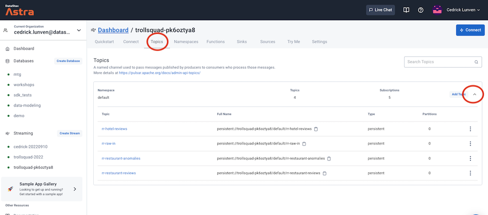


#### `✅.lab1-11`- Show your topic `rr-raw-in` in Astra User Interface:

```
gp preview --external https://astra.datastax.com/org/${ORGID}/streaming/pulsar-aws-useast2/tenants/${TENANT}/topics/namespaces/default/topics/rr-raw-in/1/0/overview
```

> 🖥️ `lab1-011 output`
>
> 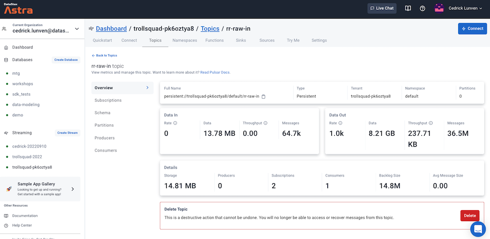


#### `✅.lab1-12`- Start the generator

```bash
/workspace/workshop-realtime-data-pipelines/revGenerator/review_generator.py -r 10
```

> 🖥️ `lab1-012 output`
>
> ```
> 2022-09-13 10:36:24.243 INFO  [140097656701568] ClientConnection:189 | [<none> -> pulsar+ssl://pulsar-aws-useast2.streaming.datastax.com:6651] Create ClientConnection, timeout=10000
> 2022-09-13 10:36:24.249 INFO  [140097656701568] ConnectionPool:96 | Created connection for pulsar+ssl://pulsar-aws-useast2.streaming.datastax.com:6651
> 2022-09-13 10:36:24.349 INFO  [140097629259520] ClientConnection:375 | [10.0.5.2:49564 -> 3.138.177.230:6651] Connected to broker
> 2022-09-13 10:36:24.818 INFO  [140097629259520] HandlerBase:64 | [persistent://trollsquad-pk6oztya8/default/rr-raw-in, ] Getting connection from pool
> 2022-09-13 10:36:24.910 INFO  [140097629259520] ClientConnection:189 | [<none> -> pulsar+ssl://pulsar-aws-useast2.streaming.datastax.com:6651] Create ClientConnection, timeout=10000
> 2022-09-13 10:36:24.915 INFO  [140097629259520] ConnectionPool:96 | Created connection for pulsar://192.168.69.127:6650
> 2022-09-13 10:36:25.016 INFO  [140097629259520] ClientConnection:377 | [10.0.5.2:56960 -> 18.223.216.1:6651] Connected to broker through proxy. Logical broker: pulsar://192.168.69.127:6650
> 2022-09-13 10:36:25.482 INFO  [140097629259520] ProducerImpl:189 | [persistent://trollsquad-pk6oztya8/default/rr-raw-in, ] Created producer on broker [10.0.5.2:56960 -> 18.223.216.1:6651] 
> * 0 ... [{"u_id": "geri", "score": 9.3, "review_type": "hotel", "item_id": "slpsnd", "item_name": "SleepSound", "text": "we terrible disgusting unsatisfactory cooked terrible", "idx": 0}]
> * 1 ... [a5VH40D^L625Z98b1BKTN@N2aCEQN=VXQTD0IaYPK[RXbZVOQZJGP2`Y;^5OZ@:EE]
> * 2 ... [{"u_id": "botz", "score": 9.600000000000001, "review_type": "hotel", "item_id": "slpsnd", "item_name": "SleepSound", "text": "excellent excellent delicious ordinary dish with is tasty", "idx": 2}]
> * 3 ... [{"u_id": "botz", "score": 9.1, "item_id": "eat_st", "item_name": "EatNStay", "text": "excellent the is excellent ordinary ordinary eating", "idx": 3}]
> ....
> ```


#### `✅.lab1-13`- Start `pulsar-shell`

For now on the first terminal will be busy with the generator. As such move to the second terminal called `2_consumer`

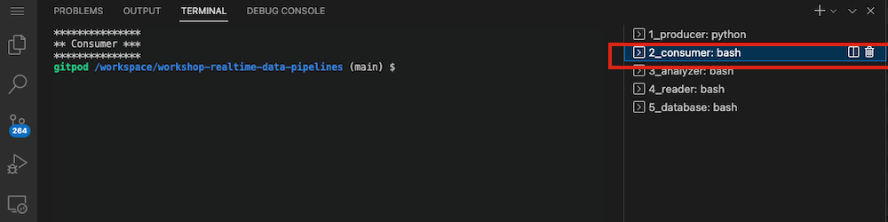

```
set -a
source .env
set +a
source /home/gitpod/.astra/cli/astra-init.sh
astra streaming  pulsar-shell ${TENANT}
```

> 🖥️ `lab1-013 output`
>
> ```
> /home/gitpod/.astra/lunastreaming-shell-2.10.1.1/conf/client-aws-useast2-trollsquad-pk6oztya8.conf
> Pulsar-shell is starting please wait for connection establishment...
> Using directory: /home/gitpod/.pulsar-shell
> Welcome to Pulsar shell!
>   Service URL: pulsar+ssl://pulsar-aws-useast2.streaming.datastax.com:6651
>   Admin URL: https://pulsar-aws-useast2.api.streaming.datastax.com
> 
> Type help to get started or try the autocompletion (TAB button).
> Type exit or quit to end the shell session.
>
> default(pulsar-aws-useast2.streaming.datastax.com)> 
> ```

#### `✅.lab1-14`- Visualize messages with a consumer using `client`

```bash
client consume persistent://${TENANT}/default/rr-raw-in -s consume_log -n 0
```

> 🖥️ `lab1-014 output`
>
> ```
> 2022-09-13T10:49:04,150+0000 [pulsar-client-io-1-1] INFO  org.apache.pulsar.client.impl.ConnectionPool - [[id: 0xf990e737, L:/10.0.5.2:54496 - R:pulsar-aws-useast2.streaming.datastax.com/3.16.119.226:6651]] Connected to server
> 2022-09-13T10:49:04,709+0000 [pulsar-client-io-1-1] INFO  org.apache.pulsar.client.impl.ConsumerStatsRecorderImpl - Starting Pulsar consumer status recorder with config: {"topicNames":["persistent://trollsquad-pk6oztya8/default/rr-raw-in"],"topicsPattern":null,"subscriptionName":"consume_log","subscriptionType":"Exclusive","subscriptionProperties":null,"subscriptionMode":"Durable","receiverQueueSize":1000,"acknowledgementsGroupTimeMicros":100000,"negativeAckRedeliveryDelayMicros":60000000,"maxTotalReceiverQueueSizeAcrossPartitions":50000,"consumerName":null,"ackTimeoutMillis":0,"tickDurationMillis":1000,"priorityLevel":0,"maxPendingChunkedMessage":10,"autoAckOldestChunkedMessageOnQueueFull":false,"expireTimeOfIncompleteChunkedMessageMillis":60000,"cryptoFailureAction":"FAIL","properties":{},"readCompacted":false,"subscriptionInitialPosition":"Latest","patternAutoDiscoveryPeriod":60,"regexSubscriptionMode":"PersistentOnly","deadLetterPolicy":null,"retryEnable":false,"autoUpdatePartitions":true,"autoUpdatePartitionsIntervalSeconds":60,"replicateSubscriptionState":false,"resetIncludeHead":false,"keySharedPolicy":null,"batchIndexAckEnabled":false,"ackReceiptEnabled":false,"poolMessages":true,"startPaused":false,"maxPendingChuckedMessage":10}
> ...
> 2022-09-13T10:49:59,192+0000 [pulsar-client-io-1-1] INFO  org.apache.pulsar.client.impl.ConsumerImpl - [persistent://trollsquad-pk6oztya8/default/rr-raw-in][consume_log] Subscribing to topic on cnx [id: 0x797d8d1d, L:/10.0.5.2:50876 - R:pulsar-aws-useast2.streaming.datastax.com/3.138.177.230:6651], consumerId 0
> 2022-09-13T10:49:59,288+0000 [pulsar-client-io-1-1] INFO  org.apache.pulsar.client.impl.ConsumerImpl - [persistent://trollsquad-pk6oztya8/default/rr-raw-in][consume_log] Subscribed to topic on pulsar-aws-useast2.streaming.datastax.com/3.138.177.230:6651 -- consumer: 0
> 2022-09-13T10:49:59,395+0000 [pulsar-client-io-1-1] INFO  com.scurrilous.circe.checksum.Crc32cIntChecksum - SSE4.2 CRC32C provider initialized
> ----- got message -----
> key:[null], properties:[], content:{"user_id": "geri", "score": 5.0, "review_type": "restaurant", "item_id": "vegg00", "item_name": "VeggieParadise", "text": "roast risotto risotto eating for for dish", "idx": 1171}
> ----- got message -----
> key:[null], properties:[], content:{"user_id": "botz", "score": 7.300000000000001, "review_type": "restaurant", "item_id": "gold_f", "item_name": "Golden Fork", "text": "with we ordinary we with cooked we ordinary", "idx": 1172}
> ```

We can kill this consumer with `CTRL + C`. 

## LAB2 - Pulsar functions

For now both terminal will 1 and 2 be busy with the generator. As such move to the second terminal called `3_analyzer`

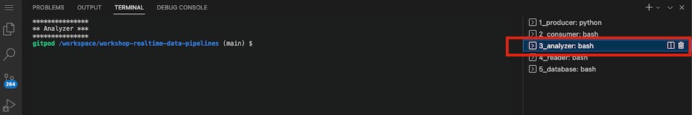


#### `✅.lab2-01`- Locate and setup the function

```bash
set -a
source .env
set +a
gp open /workspace/workshop-realtime-data-pipelines/pulsar_routing_function/review_router.py
sed -i "s/___TENANT___/${TENANT}/" /workspace/workshop-realtime-data-pipelines/pulsar_routing_function/review_router.py
```

> 🖥️ `lab2-01 output`
>
> Before `sed`:
> 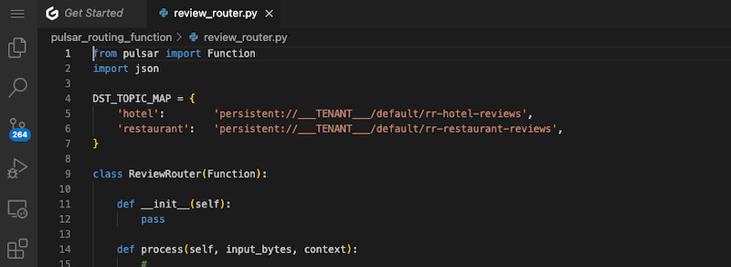
> 
> After `sed`:
> 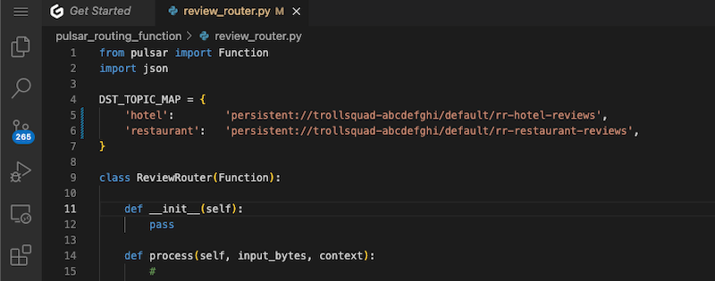

#### `✅.lab2-02`- Start Pulsar Shell (again)

```bash
source /home/gitpod/.astra/cli/astra-init.sh
astra streaming pulsar-shell ${TENANT}
```

> 🖥️ `lab2-02 output`
> ``` 
> /home/gitpod/.astra/lunastreaming-shell-2.10.1.1/conf/client-aws-useast2-trollsquad-abcdefghi.conf
> Pulsar-shell is starting please wait for connection establishment...
> Using directory: /home/gitpod/.pulsar-shell
> Welcome to Pulsar shell!
>   Service URL: pulsar+ssl://pulsar-aws-useast2.streaming.datastax.com:6651
>  Admin URL: https://pulsar-aws-useast2.api.streaming.datastax.com
> 
> Type help to get started or try the autocompletion (TAB button).
> Type exit or quit to end the shell session.
> 
> default(pulsar-aws-useast2.streaming.datastax.com)> 

#### `✅.lab2-03`- List functions in `pulsar-shell`

```bash
admin functions list --tenant=${TENANT} --namespace=default
```

> 🖥️ `lab2-03 output`
> ```
> <empty>
> ```

> **Note**:*If you need to delete a function you can also leverage on the `admin` command to do so:*
> ```bash
> admin functions delete
>     --name rrouter-function 
>     --tenant=${TENANT} 
>     --namespace=default
>```

#### `✅.lab2-04`- Create the Pulsar-function

```bash
admin functions create
  --py /workspace/workshop-realtime-data-pipelines/pulsar_routing_function/review_router.py
  --classname review_router.ReviewRouter
  --tenant ${TENANT}
  --namespace default
  --name rrouter-function
  --inputs persistent://${TENANT}/default/rr-raw-in
```

> 🖥️ `lab2-04 output`
> ```
> Created successfully
> ```

#### `✅.lab2-05`- List functions in `pulsar-shell`

```bash
admin functions list --tenant=${TENANT} --namespace=default
exit
```

> 🖥️ `lab2-05 output`
> ```
> rrouter-function
> ```

#### `✅.lab2-06`- Check on topics `rr-hotel-reviews` and `rr-restaurant-reviews`

- Hotels

```bash
gp preview --external https://astra.datastax.com/org/${ORGID}/streaming/pulsar-aws-useast2/tenants/${TENANT}/topics/namespaces/default/topics/rr-hotel-reviews/1/0
```

> 🖥️ `lab2-06 output-1`
> 
> Hotels: 
> 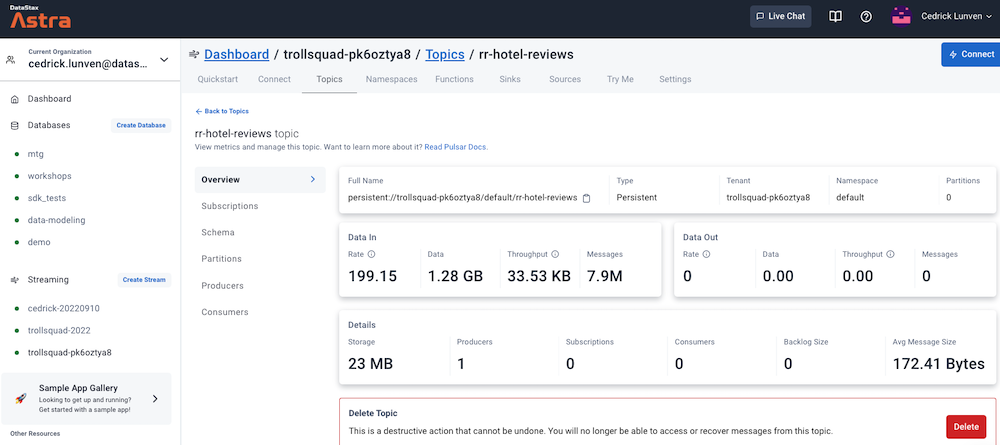

- Restaurants

```
gp preview --external https://astra.datastax.com/org/${ORGID}/streaming/pulsar-aws-useast2/tenants/${TENANT}/topics/namespaces/default/topics/rr-restaurant-reviews/1/0
```

> 🖥️ `lab2-06 output-2`
> 
> Restaurants: 
> 


#### `✅.lab2-07`- Consume 5 message in topics content with `pulsar-shell`

- Start Shell:

```
astra streaming pulsar-shell ${TENANT}
```

- Execute command:

```
client consume persistent://${TENANT}/default/rr-restaurant-reviews -s consume_log -n 5
```

> 🖥️ `lab2-07 output`
> 
> After initialization you see messages:
> [...]
> ----- got message -----
> key:[null], properties:[], content:{"user_id": "rita", "r_score": 3.9000000000000004, "tgt_name": "VeggieParadise", "tgt_id": "vegg00", "r_text": "we ordinary roast with is for for is", "idx": 9619}
> [...]
>
> If we format a sample message it looks like:
> ```json
> { 
>   "user_id": "geri", 
>    "r_score": 1.5, 
>    "tgt_name": "Pizza Smile", 
>    "tgt_id": "pizzas", 
>    "r_text": "delicious with for eating stellar excellent is", 
>    "idx": 20179
>  }
> ```

- Exit `pulsar-shell`

```bash
exit
```

#### `✅.lab2-08`- Run Analyzer

revAnalyzer is a standalone batch to evaluate which reviews are relevant and which are not.

```bash
set -a
source .env
set +a
/workspace/workshop-realtime-data-pipelines/revAnalyzer/review_analyzer.py -r -o -t -f 200
```

> 🖥️ `lab2-08 output`
> 
> ```
> Checking "known_ids_per_type" ... done.
> Checking "restaurants_by_id" ... done.
> Checking "restaurants_by_id_time" ... done.
> Checking "reviewers_by_id" ... done.
> 2022-09-13 12:46:30.012 INFO  [140019973255808] Client:88 | Subscribing on Topic :persistent://trollsquad-pk6oztya8/default/rr-restaurant-reviews
> 2022-09-13 12:46:30.012 INFO  [140019973255808] ClientConnection:189 | [<none> -> pulsar+ssl://pulsar-aws-useast2.streaming.datastax.com:6651] Create ClientConnection, timeout=10000
> 2022-09-13 12:46:30.019 INFO  [140019973255808] ConnectionPool:96 | Created connection for pulsar+ssl://pulsar-aws-useast2.streaming.datastax.com:6651
> 2022-09-13 12:46:30.121 INFO  [140019938682624] ClientConnection:375 | [10.0.5.2:33432 -> 18.223.216.1:6651] Connected to broker
> 2022-09-13 12:46:30.593 INFO  [140019938682624] HandlerBase:64 | [persistent://trollsquad-pk6oztya8/default/rr-restaurant-reviews, review-analyzer, 0] Getting connection from pool
> 2022-09-13 12:46:30.688 INFO  [140019938682624] ClientConnection:189 | [<none> -> pulsar+ssl://pulsar-aws-useast2.streaming.datastax.com:6651] Create ClientConnection, timeout=10000
> 2022-09-13 12:46:30.696 INFO  [140019938682624] ConnectionPool:96 | Created connection for pulsar://192.168.50.226:6650
> 2022-09-13 12:46:30.798 INFO  [140019938682624] ClientConnection:377 | [10.0.5.2:49968 -> 3.138.177.230:6651] Connected to broker through proxy. Logical broker: pulsar://192.168.50.226:6650
> 2022-09-13 12:46:31.263 INFO  [140019938682624] ConsumerImpl:224 | [persistent://trollsquad-pk6oztya8/default/rr-restaurant-reviews, review-analyzer, 0] Created consumer on broker [10.0.5.2:49968 -> 3.138.177.230:6651] 
> 2022-09-13 12:46:31.358 INFO  [140019938682624] HandlerBase:64 | [persistent://trollsquad-pk6oztya8/default/rr-restaurant-anomalies, ] Getting connection from pool
> 2022-09-13 12:46:31.453 INFO  [140019938682624] ClientConnection:189 | [<none> -> pulsar+ssl://pulsar-aws-useast2.streaming.datastax.com:6651] Create ClientConnection, timeout=10000
> 2022-09-13 12:46:31.460 INFO  [140019938682624] ConnectionPool:96 | Created connection for pulsar://192.168.7.141:6650
> 2022-09-13 12:46:31.558 INFO  [140019938682624] ClientConnection:377 | [10.0.5.2:41468 -> 3.16.119.226:6651] Connected to broker through proxy. Logical broker: pulsar://192.168.7.141:6650
> 2022-09-13 12:46:32.032 INFO  [140019938682624] ProducerImpl:189 | [persistent://trollsquad-pk6oztya8/default/rr-restaurant-anomalies, ] Created producer on broker [10.0.5.2:41468 -> 3.16.119.226:6651] 
> [ 20827] Outlier detected: "anne" on "Golden Fork" (rev 7.40 != avg 3.47)
> [ 24252] Outlier detected: "anne" on "Golden Fork" (rev 7.90 != avg 4.63)
> [ 24256] Outlier detected: "botz" on "Golden Fork" (rev 0.40 != avg 4.21)
> [ 24616] Outlier detected: "botz" on "Golden Fork" (rev 0.60 != avg 3.97)
> [ 25239] Restaurant Score Summary:
>                  [gold_f  25239]   "Golden Fork"      : 3.66   (outliers:      4/    64)
>                  [pizzas  25239]   "Pizza Smile"      : 0.67   (outliers:      0/    55)
>                  [vegg00  25239]   "VeggieParadise"   : 1.93   (outliers:      0/    57)
> [ 25239] Reviewer Summary:
>                    "anne"  25239 : troll-score = 0.00 (outliers:      2 /     42). Visits: gold_f(18), pizzas(12), vegg00(12)
>                    "botz"  25239 : troll-score = 0.00 (outliers:      2 /     43). Visits: gold_f(13), pizzas(14), vegg00(16)
>                    "geri"  25239 : troll-score = 0.66 (outliers:      0 /     41). Visits: gold_f(12), vegg00(2)
>                    "john"  25239 : troll-score = 0.00 (outliers:      0 /     35). Visits: gold_f(13), pizzas(10), vegg00(12)
>                    "rita"  25239 : troll-score = 0.00 (outliers:      0 /     39). Visits: gold_f(7), pizzas(18), vegg00(14)
> [ 25239] Writing to DB ... done.
> ```

#### `✅.lab2-09`- Change Terminal

All terminal are busy. Let us move to the terminal called `4_reader`

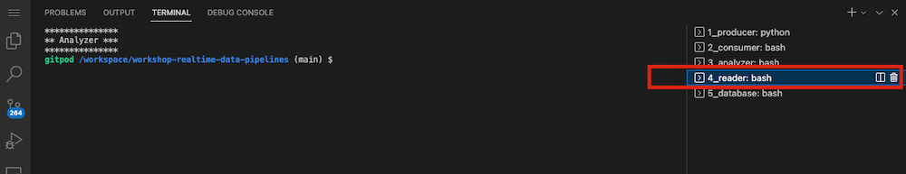

#### `✅.lab2-010`- Start reader to log anomalies in shell `reader`

```bash
set -a
source .env
set +a
/workspace/workshop-realtime-data-pipelines/tools/reader.py -t rr-restaurant-anomalies
```

> 🖥️ `lab2-10 output`
> 
> ```
> 2022-09-13 12:52:16.261 INFO  [139762389439104] Client:88 | Subscribing on Topic :persistent://trollsquad-pk6oztya8/default/rr-restaurant-anomalies
> 2022-09-13 12:52:16.262 INFO  [139762389439104] ClientConnection:189 | [<none> -> pulsar+ssl://pulsar-aws-useast2.streaming.datastax.com:6651] Create ClientConnection, timeout=10000
> 2022-09-13 12:52:16.267 INFO  [139762389439104] ConnectionPool:96 | Created connection for pulsar+ssl://pulsar-aws-useast2.streaming.datastax.com:6651
> 2022-09-13 12:52:16.380 INFO  [139762369062656] ClientConnection:375 | [10.0.5.2:40472 -> 3.16.119.226:6651] Connected to broker
> 2022-09-13 12:52:16.852 INFO  [139762369062656] HandlerBase:64 | [persistent://trollsquad-pk6oztya8/default/rr-restaurant-anomalies, my-sub, 0] Getting connection from pool
> 2022-09-13 12:52:16.945 INFO  [139762369062656] ClientConnection:189 | [<none> -> pulsar+ssl://pulsar-aws-useast2.streaming.datastax.com:6651] Create ClientConnection, timeout=10000
> 2022-09-13 12:52:16.951 INFO  [139762369062656] ConnectionPool:96 | Created connection for pulsar://192.168.7.141:6650
> ...
> [2022-09-13T12:52:40] Received message 217:
>     Type = JSON
>         {
>             "detected_by": "review_analyzer.py",
>             "idx": 22650,
>             "r_score": 9.4,
>             "r_text": "roast superb roast ordinary superb superb stellar we",
>             "tgt_id": "gold_f",
>             "tgt_name": "Golden Fork",
>             "user_id": "botz"
>         }
> ...
> ```

> **Note**: *you can customize the behaviour of those commands - try passing `-h`to the scripts to see what is available*.

## LAB3 - Working with databases

All terminal are busy. Let us move to the terminal called `5_database`


The only missing piece at this point are direct database queries. You can access the tables in any way you want, for instance using the provided [CQL shell on the Astra DB UI](https://github.com/datastaxdevs/awesome-astra/wiki/Cql-Shell): just inspect the `trollsquad` keyspace and try to `SELECT` rows from the tables you find there.

#### `✅.lab3-01`- Display schema

You will notice that the restaurant reviews are written in _two_ tables: 

- one will simply contain the latest average score for each restaurant

```bash
set -a
source .env
set +a
source /home/gitpod/.astra/cli/astra-init.sh
astra db cqlsh workshops -e "describe table trollsquad.restaurants_by_id;"
```

> 🖥️ `lab3-01 output (1)`
> ```sql
> [ INFO ] - Cqlsh has been installed
> 
> Cqlsh is starting please wait for connection establishment...
> 
> CREATE TABLE trollsquad.restaurants_by_id (
>     id text PRIMARY KEY,
>     average float,
>     hits int,
>     name text,
>     num_outliers int
> )
> ```

> **Note**:*Sometimes you can hit a timeout error, it that is the case reexcute the same command.*

- the other is structured to offer historical data for e.g. a plotting client application (there is some built-in eviction of old results to avoid unbound growth of the table).

```bash
source /home/gitpod/.astra/cli/astra-init.sh
astra db cqlsh workshops -e "describe table trollsquad.restaurants_by_id_time;"
```

> 🖥️ `lab3-01 output (2)`
> ```sql
> CREATE TABLE trollsquad.restaurants_by_id_time (
>     id text,
>     time timestamp,
>     average float,
>     name text,
>     PRIMARY KEY (id, time)
> ) WITH CLUSTERING ORDER BY (time ASC)
> ```


#### `✅.lab3-02`- What restaurants can be queried?

```bash
astra db cqlsh workshops \
   -e "select * from trollsquad.known_ids_per_type where id_type='restaurant'"
```

> 🖥️ `lab3-02 output`
> ```sql
>  id_type    | ids
> ------------+--------------------------------
>  restaurant | {'gold_f', 'pizzas', 'vegg00'}
> ```

#### `✅.lab3-03`- What reviewers can be queried?

```bash
astra db cqlsh workshops \
   -e "select * from trollsquad.known_ids_per_type where id_type='reviewer'"
```

> 🖥️ `lab3-03 output`
> ```sql
>  id_type    | ids
> ------------+--------------------------------
>  reviewer | {'anne', 'botz', 'geri', 'john', 'rita'}
> ```

#### `✅.lab3-04`- What's the current status of a restaurant?

```bash
astra db cqlsh workshops \
   -e "select * from trollsquad.restaurants_by_id where id='vegg00'"
```

> 🖥️ `lab3-04 output`
> ```sql
> id     | average | hits | name           | num_outliers
> --------+---------+------+----------------+--------------
>  vegg00 | 1.93489 |   57 | VeggieParadise |            0
>
> ```

#### `✅.lab3-05`- What's the current status of a reviewer?

```bash
astra db cqlsh workshops \
   -e "select * from trollsquad.reviewers_by_id where id='geri'"
```

> 🖥️ `lab3-05 output`
> ```sql
>  id   | hits | num_outliers | target_map                  | trollings
> ------+------+--------------+-----------------------------+-----------
> geri |   83 |            0 | {'gold_f': 16, 'vegg00': 4} |        63
>
> ```

#### `✅.lab3-06`- What is the timeline of reviews for a restaurant?

```bash
astra db cqlsh workshops \
   -e "select * from trollsquad.restaurants_by_id_time where id='gold_f'"
```

> 🖥️ `lab3-05 output`
> ```sql
> id     | time                            | average | name
> --------+---------------------------------+---------+-------------
>  gold_f | 2022-09-13 00:48:51.481000+0000 | 5.14027 | Golden Fork
>  gold_f | 2022-09-13 00:48:52.782000+0000 | 4.02716 | Golden Fork
>  gold_f | 2022-09-13 00:48:59.465000+0000 |  2.9716 | Golden Fork
>  gold_f | 2022-09-13 00:49:01.645000+0000 | 4.91724 | Golden Fork
>  gold_f | 2022-09-13 00:49:03.377000+0000 | 4.09476 | Golden Fork
>  gold_f | 2022-09-13 00:49:05.156000+0000 | 3.31554 | Golden Fork
>  gold_f | 2022-09-13 00:49:06.902000+0000 | 4.79082 | Golden Fork
>  gold_f | 2022-09-13 00:49:08.588000+0000 | 3.13101 | Golden Fork
>  gold_f | 2022-09-13 00:49:10.141000+0000 | 4.96983 | Golden Fork
>  gold_f | 2022-09-13 00:49:12.284000+0000 | 4.87864 | Golden Fork
>  gold_f | 2022-09-13 00:49:13.722000+0000 | 4.18713 | Golden Fork
>  gold_f | 2022-09-13 00:49:15.501000+0000 |  2.9564 | Golden Fork
> ```

## LAB4 - Pulsar I/O

We used a standalone analyzer to create the tables and populate values. What if, each time a data is inserted in a topic it is also copied in the db.

#### `✅.lab4-01`- Analyzing message syntax in `rr-restaurant-anomalies`

- Start Pulsar-shell again

```bash
astra streaming pulsar-shell ${TENANT}
```

- Consume a couple of messages in `rr-restaurant-anomalies` (the analyzer should be running)

```bash
client consume persistent://${TENANT}/default/rr-restaurant-anomalies -s log -n 5
```

- Looking at message structure, the output look like

```bashing

[...]
key:[null], properties:[], content:{"user_id": "botz", "r_score": 6.4, "tgt_name": "Pizza Smile", "tgt_id": "pizzas", "r_text": "eating is for ordinary is", "idx": 17261, "detected_by": "review_analyzer.py"}
----- got message -----
[...]
```

- Extracting one message and formatting as `JSON`:

```json
{ 
  "user_id": "geri", 
  "r_score": 5.7, 
  "tgt_name": "Golden Fork", 
  "tgt_id": "gold_f", 
  "r_text": "dish the the is dish with we", 
  "idx": 17845,  
  "detected_by": "review_analyzer.py"
}
```

Let us do a couple of assumptions:
- idx ensures unicity of a record
- we want to search by user

```sql
CREATE TABLE IF NOT EXISTS trollsquad.msg_rr_restaurant_anomalies (
     user_id  text,
     idx      int,
     r_score  double,
     tgt_name text,
     tgt_id   text,
     r_text   text,
     detected_by text,
     PRIMARY KEY (user_id, idx)
) WITH CLUSTERING ORDER BY (idx ASC);
```

- Exit the `pulsar-shell`

```bash
exit
```

#### `✅.lab4-02`- Create the associated Table

- Create the table through CQL

```bash
astra db cqlsh workshops -e "CREATE TABLE IF NOT EXISTS trollsquad.msg_rr_restaurant_anomalies ( \
      user_id  text, \
      idx      int, \
      r_score  double, 
      tgt_name text,\
      tgt_id   text,\
      r_text   text,\
      detected_by text,\
      PRIMARY KEY (user_id, idx)\
  ) WITH CLUSTERING ORDER BY (idx ASC);"
```

- Check table now exist

```bash
astra db cqlsh workshops -e "describe table trollsquad.msg_rr_restaurant_anomalies;"
```

- Check content of the table

```bash
astra db cqlsh workshops -e "select * FROM trollsquad.msg_rr_restaurant_anomalies LIMIT 10;"
```

#### `✅.lab4-03`- Create a Sink with the user interface

> **Note**:[Reference Documentation](https://docs.datastax.com/en/astra-streaming/docs/astream-astradb-sink.html)

- In the dashboard of your tenant, locate the tab `Sinks` and select button `[Create Sink]`.

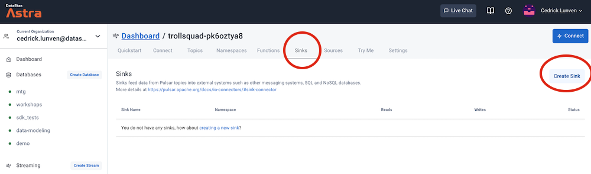

- Enter General attributes (part 1)

| Attribute | Value | Description |
| --------- | ----- | ----------- |
| Namespace | `default` | The namespace we work with from the beginning |
| Sink Type | `Astra DB` | You can define external systems but here we stay in Astra |
| Name  | `sink-anomalies` | Pick anything unique, here reminding the source topic |
| Topic | `rr-restaurant-anomalies` | The one we decided to save |


- Get your token value. You need to remind the token we used today, the first entry your provided:

```bash
astra config get default --key ASTRA_DB_APPLICATION_TOKEN
```

- Enter Database attributes (part 2)

| Attribute | Value | Description |
| --------- | ----- | ----------- |
| Database | `workshops` | db created it in the beginning |
| Keyspace | `trollsquad` | keyspace we created in the beginning |
| TableName | `msg_rr_restaurant_anomalies` | Table we created before |
| Token | `<your_token>` | Do not copy-paste the value but use YOUR token. |

And for Mapping. It is a mapping 1 to 1 from message attributes to db columns.

```csv
user_id=value.user_id,idx=value.idx,r_score=value.r_score,tgt_name=value.tgt_name,tgt_id=value.tgt_id,r_text=value.r_text,detected_by=value.detected_by
```

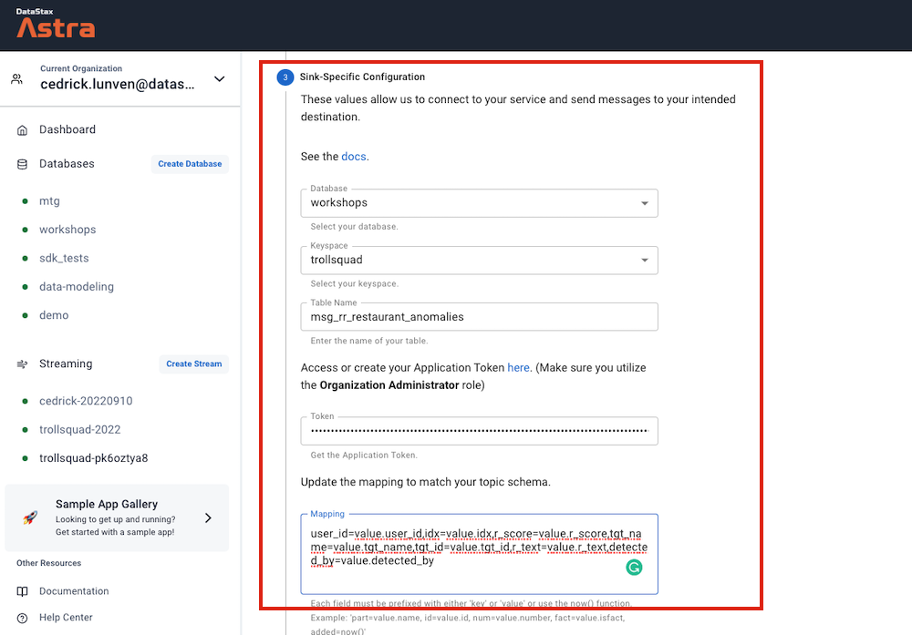

- These were the last entries you can now click the `[Create]` button

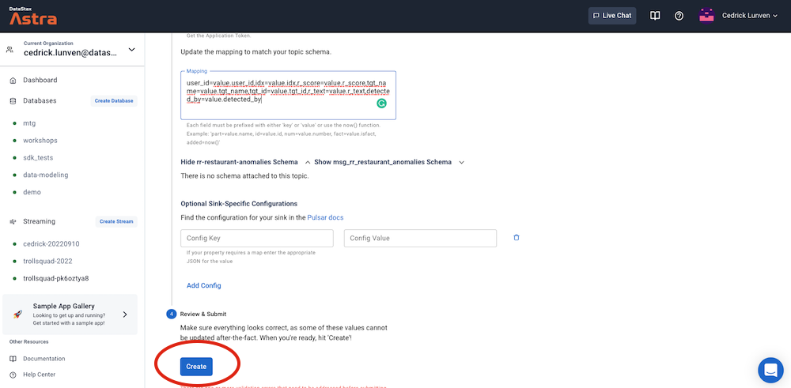

- The sink will take about a minute to initialize and start:

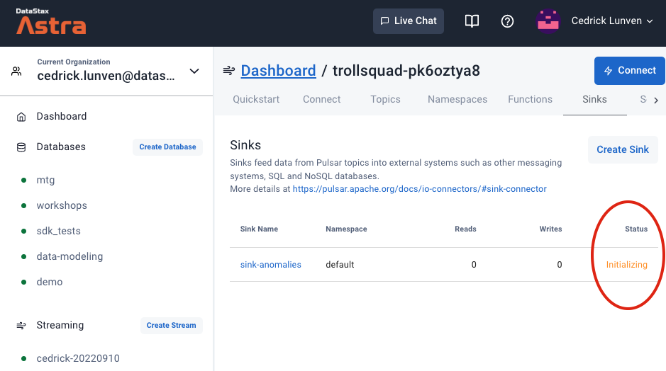

- When it is ready the status will switch to `running`

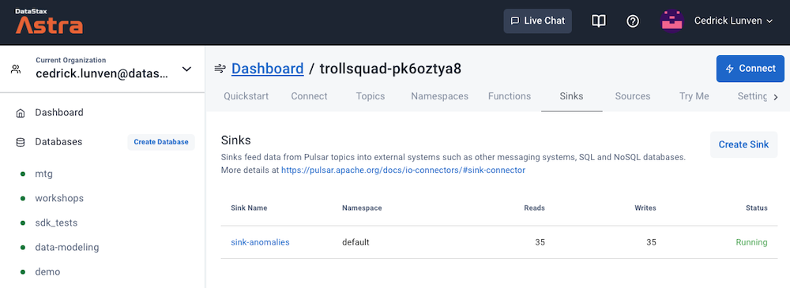

- You can get the details by clicking on the sink name in the table

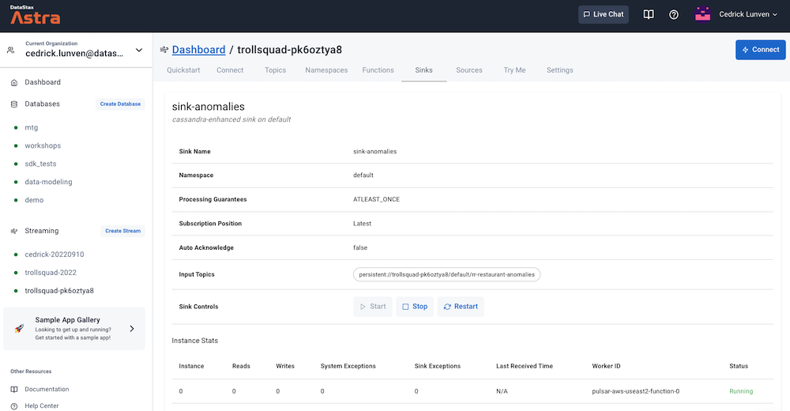


#### `✅.lab4-04`- Query the destination table 


```bash
astra db cqlsh workshops -e "select * FROM trollsquad.msg_rr_restaurant_anomalies LIMIT 10;"
```

> 🖥️ `lab4-04 output`
>
> `YOUR_HOMEWORK`

## Homework

To submit the **homework**, please take a screenshot in gitpod with the result of lab `✅.lab4-04`, you will have different values than the ones showed during the live.

Don't forget to [submit your homework](https://dtsx.io/homework-realtime-data-pipelines) and be awarded a nice verified badge!

## What's NEXT ?

We've just scratched the surface of what you can do using Astra DB, built on Apache Pulsar and Cassandra.

Go take a look at [DataStax for Developers](https://www.datastax.com/dev) to see what else is possible.

There's plenty to dig into!

Congratulations: you made to the end of today's workshop.

Don't forget to [submit your homework](https://dtsx.io/homework-realtime-data-pipelines) and be awarded a nice verified badge!


**... and see you at our next workshop!**


