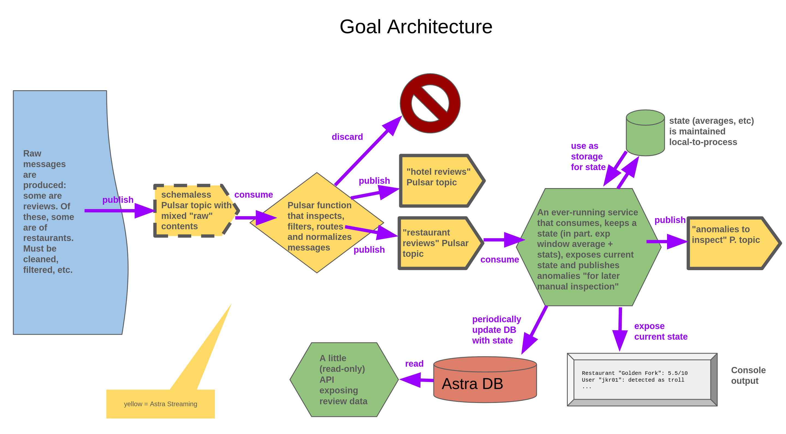

# TODO

Switch from dockerized Pulsar to Astra Streaming (adapting .env, etc)

Avro schema in all topics except the 'raw' one

(a couple of plots to show the relation between restaurants' "real score" slow oscillations, individual users' fuzzed review scores, and rolling averages?)

Persistence triggered by either number OR elapsed time

better output

better readme: (1) DB and (2) showcase REST API curls to directly read off DB

move this repo over to datastaxdevs
